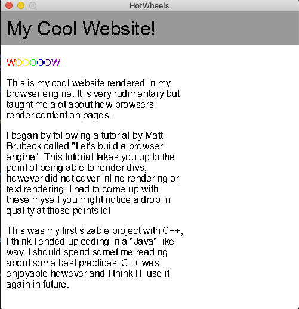

# hot-wheels

Toy browser engine built with C++11, built for learning a bit about the wizardry that is a browser.

This is extremely stripped back, things like JS are a whole other thing which is out of scope of this project. It probably won't even fetch stuff from the web, just feed in input through args. I might come back and look at this if I enjoy the project. 

# Building

```bash
mkdir build
cd build 
cmake ..
make 
```

# Running

From project root, run
```
./hotwheels
```

# Example



<details><summary>Input Files</summary>
HTML input

```
<!doctype html>
<html>
  <head>
    <style>
      .red {
        color: #ff0000;
      }
      .orange {
        color: #fcba03;
      }
      .yellow {
        color: #FFFF00;
      }
      .green {
        color: #00FF00;
      }
      .blue {
        color: #0000FF;
      }
      .indigo {
        color: #4B0082;
      }
      .violet {
        color: #9400D3;
      }
    </style>
  </head>
  <body>
    <header class="banner">
      <h1>My Cool Website!</h1>
    </header>
    <div class="container">
      <div class="column">
        <p>
          <span class="red">W</span>
          <span class="orange">O</span>
          <span class="yellow">O</span>
          <span class="green">O</span>
          <span class="blue">O</span>
          <span class="indigo">O</span>
          <span class="violet">W</span>

        </p>

        <p>This is my cool website rendered in my browser engine. It is very rudimentary but taught me alot about how browsers render content on pages.</p>
        <p>I began by following a tutorial by Matt Brubeck called "Let's build a browser engine". This tutorial takes you up to the point of being able to render divs, however did not cover inline rendering or text rendering. I had to come up with these myself you might notice a drop in quality at those points lol
        </p>
        <p>This was my first sizable project with C++, I think I ended up coding in a "Java" like way. I should spend sometime reading about some best practices. C++ was enjoyable however and I think I'll use it again in future.</p>
      </div>
      
    </div>
  </body>
</html>
```

CSS input
```css
header {
  width: 500px;
  background-color: #999999;
  padding: 10px;
  margin-bottom: 10px;
}
.column {
  width: 50%;
  margin: 10px;
}
```
</details>


## HTML Subset

Syntax can contain 

- Balanced tags e.g. `<title>...</title>`
- Attributes


## How does a browser engine work? 

The main flow of a browser engine follows a pipe and filter system, HTML and CSS files are fed in as input, parsed and combined to produce a set of requirements for each element on the page, we then calculate the position on screen, producing a render tree which is passed to a painter. 


**Goals** 

**Milestone 1**
- [x] Parse a subset of HTML
- [x] Parse a subset of CSS attributes
- [x] Arrange elements using blocks
- [x] Paint to a window

**Milestone 2**
- [x] Draw Inline Boxes
- [x] Render text in boxes
- [x] Text Sizing
- [x] Style tags

**Project Wrap Up**
- [x] Take files in from command line
- [x] Create sample to demonstrate what the engine can do

